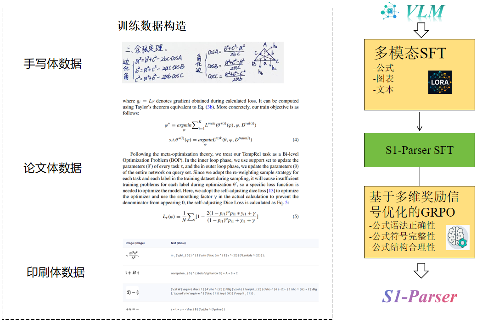

# 📄 S1-Parser: Efficient Multimodal Document Parsing via Dynamic Structure-Semantics Fusion 

<p align="center">
          🔗 <a href="https://github.com/ScienceOne-AI/S1-Parser">Codebase</a>&nbsp&nbsp 📥 <a href="https://modelscope.cn/models/xdcaxy2013/S1-Parser/summary">ModelBase</a>&nbsp&nbsp  
</p>


**S1-Parser** is a highly efficient multimodal text parsing tool designed to enable accurate and efficient parsing of complex documents. Instead of relying solely on static fine-tuning or single-stage optimization, it employs a strategy of first Supervised Fine-Tuning (SFT) then Reinforcement Learning (RL), effectively fine-tuning the model on critical aspects such as formula syntax correctness, symbol integrity, and structural rationality—balancing parsing precision and efficiency across diverse document types.

<!-- --- 
This repository implements **S1-Parser**, as described in our paper:

> *Learning : Shaping *  
--- -->



---

## 📰 News

- ***[2025/10/28]*** We release the [Code](https://github.com/ScienceOne-AI/S1-Parser) for *S1-Parser*.  


## 🚀 Features

- 🧩 **Supervised Fine-Tuning** with task-oriented ([Parse Target: Scientific Equations]) to sharpen domain adaptation.
- 🎯 **Multi-stage RL** to refine, stabilize, and accelerate the learning process in strategic of behaviors.
- 📊 Benchmarked on Scientific Literature Dataset: SCI_LLM

---

## 🛢️ Benchmarks

- [sci_llm](https://huggingface.co/datasets/1398listener/tmp_7/blob/main/sci_llm.zip)
- [LaTeX_OCR](https://huggingface.co/datasets/linxy/LaTeX_OCR)

---

## ⚙️ Environment Setup (Recommended)

We recommend using **Python 3.10** and **PyTorch ≥ 2.7**.  

Install the environment:
```bash
# Recommend Python 3.10.18
git clone https://github.com/ScienceOne-AI/S1-Parser.git
cd S1-Parser
pip install -r requirements.txt
```

## 🏋️ Training

S1-Parser training proceeds in **two stages** with different designs:

```bash
# Stage 1: Execute the Supervised Fine-Tuning (SFT) to acquire fundamental LaTeX OCR.
bash scripts/run_train_ocr_sft_model.sh

# Stage 2: Execute the GRPO training to optimize LaTeX formula syntax, symbol and structure.
bash scripts/run_train_ocr_grpo_model.sh

```

---

Make sure to configure your model paths and data in `script/run_train_ocr_*.sh`.


<!-- --- 


---

## 📈 Evaluation

After training, evaluate the model using:

```bash
bash scripts/eval/eval_model.sh
```

## 📊 Results


--- -->

---

## 🔍 Acknowledgements

We build and reference on the following open source trunks, and thank the following sources for their contributions to the open source community:
- [Qwen2.5-VL](https://github.com/QwenLM/Qwen2.5-VL)
- [olmOCR](https://github.com/allenai/olmocr)
- [MonkeyOCR](https://github.com/Yuliang-Liu/MonkeyOCR)
- [MistralOCR](https://mistral.ai/news/mistral-ocr)
- [Dolphin](https://github.com/ByteDance/Dolphin.git)
